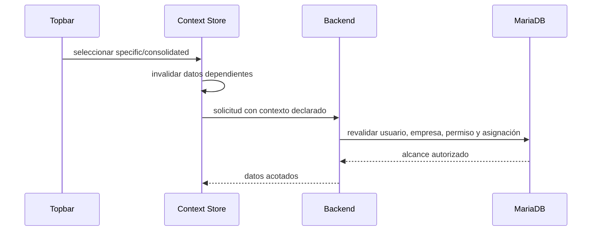

# ADR-001: Contexto multisucursal global

- **Estado:** Propuesto
- **Fecha:** 2026-07-20

## Contexto

TecnoOne ya dispone de `sucursales`, `usuario_sucursales`, una sucursal predeterminada, selector en el topbar y middleware `sucursalContext`. Sin embargo, el middleware solo protege el catálogo empresarial de Cajas y los módulos operativos todavía trabajan a nivel de empresa.

La opción “Todas las sucursales” existente en la administración de Cajas del Super Admin es un filtro local y no un contexto global.

## Decisión

Se establecen dos modos explícitos:

- `specific`: una sucursal activa concreta, válida y asignada al usuario.
- `consolidated`: consulta sobre el conjunto autorizado de sucursales.

No se creará una sucursal ficticia “Todas”. El consolidado no se representará mediante `0`, `-1` ni un ID especial.

El backend construirá un alcance autoritativo equivalente a:

```text
branchScope.mode
branchScope.empresaId
branchScope.sucursalId
branchScope.allowedSucursalIds
```

La empresa provendrá exclusivamente del usuario revalidado. En modo específico, la sucursal se validará contra empresa, estado y `usuario_sucursales`. En consolidado se exigirá permiso explícito y se limitará el conjunto permitido.

Toda escritura operativa requiere `specific`. Si una pantalla consolidada inicia una operación, deberá solicitar una sucursal destino y cambiar a un alcance específico validado antes de escribir.

## Selector y persistencia

El topbar mostrará sucursales activas asignadas y, únicamente con permiso, “Todas las sucursales”. La selección inicial será:

1. última selección válida del usuario;
2. `es_predeterminada`;
3. primera sucursal activa asignada.

La persistencia frontend es una preferencia, no una autorización. Un cambio de contexto debe invalidar stores, cachés y solicitudes dependientes.



## Autorización

La autorización efectiva es la intersección de:

- empresa autenticada;
- módulo habilitado por plan;
- permiso RBAC;
- sucursales asignadas;
- modo de contexto;
- alcance de la entidad solicitada.

Los roles conceptuales son Super Admin, admin empresa, admin sucursal y usuario operativo. Los nombres de rol no evitan la comprobación de permisos.

## Consecuencias

### Positivas

- Un contrato uniforme para todos los módulos.
- Consolidación sin filas artificiales ni IDs mágicos.
- Menor riesgo de fuga lateral.
- Escrituras operativas siempre atribuibles a una sucursal.

### Costos

- Adaptación módulo por módulo.
- Invalidación coordinada del estado frontend.
- Nuevas pruebas de aislamiento y concurrencia.
- Definición explícita de operaciones permitidas desde vistas consolidadas.

## Alternativas descartadas

- Incluir la sucursal activa en el JWT: obliga a regenerar tokens y puede quedar desactualizada.
- Confiar en `empresa_id` o `sucursal_id` del body: permite manipular el alcance.
- Crear una sucursal “Todas”: rompe integridad referencial y mezcla una vista con una entidad operativa.
- Permitir escrituras consolidadas implícitas: deja indeterminado el destino de la operación.

## Criterios de aceptación

- Ninguna ruta empresarial deriva la empresa del frontend.
- Toda ruta operativa declara y valida contexto.
- Consolidado exige permiso explícito.
- Toda escritura operativa tiene sucursal específica.
- Cambiar contexto no conserva datos visibles del contexto anterior.
