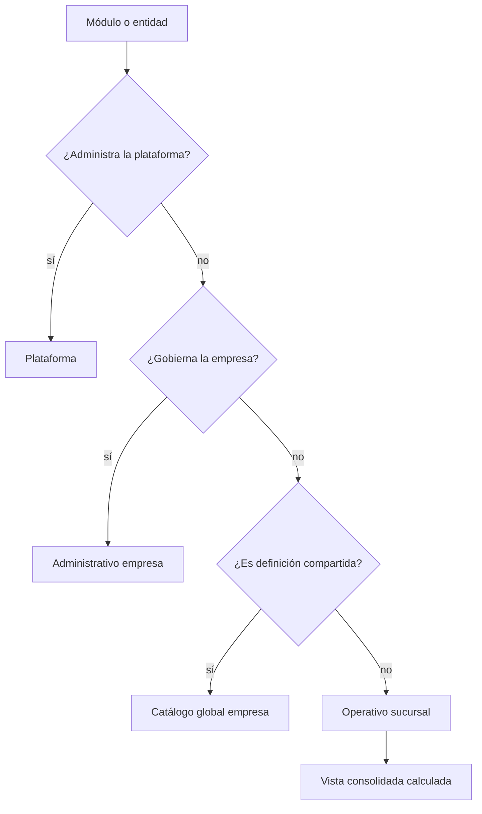

# ADR-002: Clasificación de módulos y alcance de datos

- **Estado:** Propuesto
- **Fecha:** 2026-07-20

## Contexto

El selector de sucursal no debe afectar de la misma forma a todos los módulos. Algunos administran el tenant completo, otros son catálogos compartidos y otros representan actividad física u operativa de una sucursal.

Aplicar indiscriminadamente `sucursal_id` duplicaría datos globales, mientras que ignorarlo en operaciones produciría mezclas y fugas entre sucursales.

## Decisión

Cada módulo se clasifica antes de migrarse:

1. **Plataforma:** administración SaaS fuera del contexto operativo empresarial.
2. **Administrativo de empresa:** gobierna el tenant completo; puede usar filtros locales.
3. **Catálogo global de empresa:** una definición compartida, consumida desde cualquier sucursal.
4. **Operativo de sucursal:** datos y transacciones atribuibles a una sucursal.
5. **Consulta agregada:** proyección calculada sobre las sucursales autorizadas.

## Matriz de módulos

| Módulo | Tipo | Alcance de almacenamiento | Comportamiento del topbar |
|---|---|---|---|
| Super Admin, empresas, planes | Plataforma | Plataforma/empresa elegida por ruta protegida | No usa selector operativo |
| Sucursales | Administrativo empresa | Empresa | Vista empresa; filtro opcional |
| Usuarios | Administrativo empresa | Empresa + asignaciones | Toda la empresa con filtro local por sucursal |
| Roles y permisos | Administrativo empresa | Empresa | No cambia por sucursal |
| Configuración | Administrativo empresa | Empresa | No cambia por sucursal |
| Productos | Catálogo global empresa | Empresa | Mismo producto; muestra existencia del contexto |
| Clientes | Catálogo global empresa | Empresa | Compartidos; actividad puede filtrarse |
| Proveedores | Catálogo global empresa | Empresa | Compartidos; actividad puede filtrarse |
| Existencias/kardex | Operativo sucursal | Empresa + sucursal | Filtra o agrega según contexto |
| Cajas | Operativo sucursal | Empresa + sucursal | Filtra; consolidado solo consulta |
| Ventas | Operativo sucursal | Empresa + sucursal | Filtra; consolidado solo consulta |
| Compras/recepciones | Operativo sucursal | Empresa + sucursal | Filtra; consolidado solo consulta |
| Reparaciones | Operativo sucursal | Empresa + sucursal | Filtra; consolidado solo consulta |
| Transferencias | Operativo entre sucursales | Empresa + origen + destino | Flujo explícito y transaccional |
| Dashboard/reportes | Consulta agregada | Derivado | Specific o consolidated |
| Auditoría | Consulta/administrativo | Empresa + sucursal cuando aplique | Filtra o agrega |

## Reglas especiales

### Usuarios

Usuarios es administrativo y puede mostrar toda la empresa aun cuando el topbar esté en `specific`. La pantalla puede ofrecer filtro local por sucursal asignada, claramente separado del contexto operativo. Asignar sucursales requiere permiso administrativo y validación de empresa.

### Clientes y proveedores

Son globales por empresa para evitar duplicados, identidades divergentes y fragmentación del historial. Las ventas, compras y reparaciones relacionadas conservan su propia sucursal.

### Productos

La definición comercial es global por empresa. La existencia, reserva, disponibilidad y kardex son por sucursal. Una consulta consolidada suma existencias sin duplicar el producto.

### Escrituras

- Administrativas de empresa: pueden ejecutarse fuera de un contexto operativo, con permiso empresarial.
- Catálogos globales: se autorizan por empresa y permiso.
- Operativas: requieren siempre una sucursal específica.
- Transferencias: requieren origen y destino explícitos, ambos autorizados y de la misma empresa.

## Consecuencias

- El selector no puede aplicarse mecánicamente a todas las pantallas.
- Cada endpoint debe declarar su clasificación y política de contexto.
- Los filtros locales administrativos no deben modificar el contexto global.
- Los reportes consolidados deben agregar datos operativos, no consultar una supuesta sucursal “Todas”.

## Estrategia de adopción

Para cada módulo:

1. inventariar tablas, endpoints, stores y reportes;
2. clasificar cada entidad;
3. documentar lecturas y escrituras;
4. introducir alcance de sucursal solo donde corresponda;
5. probar empresa, sucursal específica y consolidado;
6. activar el módulo cuando todas sus rutas respeten la misma política.

No se considera migrado un módulo si solo su listado principal aplica el contexto.
