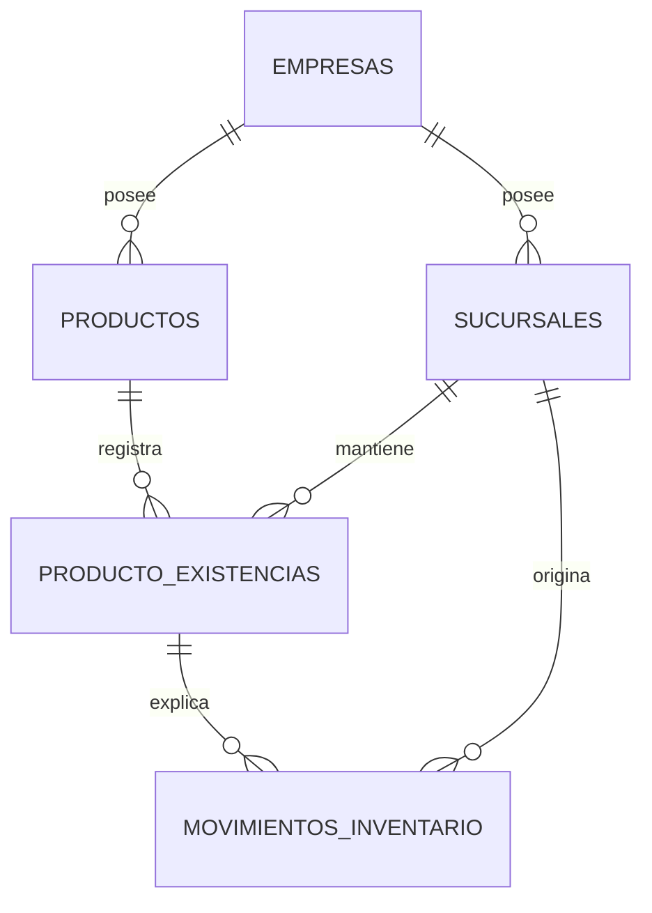
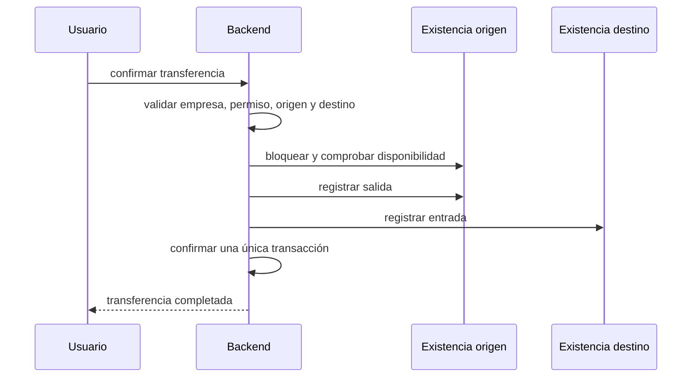

# ADR-003: Inventario y existencias por sucursal

- **Estado:** Propuesto
- **Fecha:** 2026-07-20

## Contexto

TecnoOne necesita conservar un catálogo único de productos por empresa y, simultáneamente, conocer la disponibilidad física en cada sucursal. Duplicar productos por sucursal fragmentaría códigos, precios, imágenes e historial. Mantener un único stock empresarial impediría controlar ventas, compras y transferencias locales.

## Decisión

Los productos serán globales por empresa. Las existencias y reservas serán por sucursal.

Modelo conceptual:

```text
productos
- id
- empresa_id
- datos comerciales globales

producto_existencias
- empresa_id
- sucursal_id
- producto_id
- existencia
- reservado
- parámetros locales opcionales

movimientos_inventario
- empresa_id
- sucursal_id
- producto_id
- tipo
- cantidad
- referencia operativa
- usuario_id
- fecha
```

La unicidad de `producto_existencias` será `(empresa_id, sucursal_id, producto_id)`. Las FKs deben impedir relaciones entre empresas distintas.

## Inventario general

El inventario consolidado se calcula; no se almacena como un segundo saldo independiente:

```sql
SELECT producto_id, SUM(existencia) AS existencia_total
FROM producto_existencias
WHERE empresa_id = ?
  AND sucursal_id IN (...sucursales autorizadas...)
GROUP BY producto_id;
```

El producto aparece una sola vez. La vista puede desplegar el total y un desglose por sucursal.



## Reglas operativas

- Una venta descuenta existencia de su sucursal y caja asociada.
- Una compra aumenta existencia en la sucursal receptora al confirmarse la recepción.
- Una reparación consume repuestos desde la sucursal responsable.
- Un ajuste afecta una sola sucursal y requiere permiso y auditoría.
- No se permite stock negativo salvo decisión funcional explícita y controlada.
- Toda modificación de saldo y su movimiento se ejecutan en la misma transacción.
- El backend bloquea IDs de producto o sucursal pertenecientes a otra empresa.

## Transferencias

Una transferencia no es una edición directa de dos saldos. Es una operación empresarial con:

- sucursal origen;
- sucursal destino;
- líneas de productos y cantidades;
- estados controlados;
- usuario solicitante y confirmante;
- movimientos correlacionados de salida y entrada.



Las transferencias requieren dos sucursales específicas autorizadas. No son una escritura genérica en modo consolidado.

## Contextos de consulta

### Specific

- muestra existencia, reservado, disponible y kardex de una sucursal;
- permite operaciones si el usuario tiene permiso;
- deriva la sucursal del contexto validado.

### Consolidated

- muestra `SUM` sobre las sucursales autorizadas;
- permite desglose por sucursal;
- no permite ajustes, ventas, recepciones ni consumos sin seleccionar sucursal;
- no crea ni consulta una sucursal ficticia “Todas”.

## Seguridad

- Nunca confiar en `empresa_id` o `sucursal_id` del frontend.
- Incluir empresa y sucursal en lecturas, actualizaciones y bloqueos.
- Validar que documentos, cajas, productos y sucursales pertenezcan al mismo tenant.
- Proteger contra doble descuento mediante transacciones y bloqueo de filas.
- Evitar que caches del contexto anterior muestren o modifiquen existencias actuales.
- Auditar ajustes, transferencias y migraciones de saldo.

## Migración propuesta

1. Diagnosticar stock actual, kardex y documentos históricos.
2. Crear `producto_existencias` y estructuras de transferencias inicialmente sin retirar el stock legado.
3. Definir una regla verificable de backfill; cuando no haya evidencia, registrar explícitamente la asignación excepcional a la principal.
4. Comparar el total anterior con `SUM` de las nuevas existencias por empresa y producto.
5. Adaptar lecturas específicas y consolidadas.
6. Adaptar ajustes y kardex.
7. Adaptar compras, ventas y reparaciones en sprints separados.
8. Activar transferencias.
9. Convertir campos obligatorios, crear FKs e índices definitivos.
10. Retirar el saldo legado únicamente después de conciliación y observación.

## Índices mínimos conceptuales

- `UNIQUE (empresa_id, sucursal_id, producto_id)` en existencias.
- Índice de consulta consolidada `(empresa_id, producto_id, sucursal_id)`.
- Índice de disponibilidad local `(empresa_id, sucursal_id, producto_id)`.
- Índice de kardex `(empresa_id, sucursal_id, producto_id, fecha)`.
- Índices de transferencia por empresa, origen, destino y estado.

## Criterios de aceptación

- Un producto no se duplica al existir en varias sucursales.
- La suma de existencias locales coincide con el inventario general.
- Una operación local nunca afecta otra sucursal.
- Una transferencia produce movimientos balanceados y atómicos.
- Los usuarios solo consultan sucursales autorizadas.
- No existe escritura operativa sin sucursal específica.
