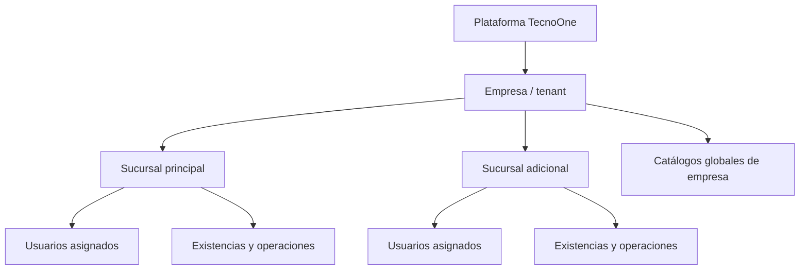
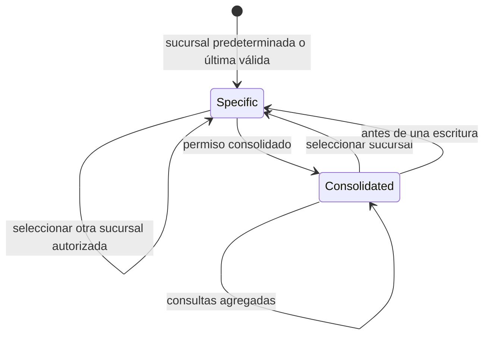
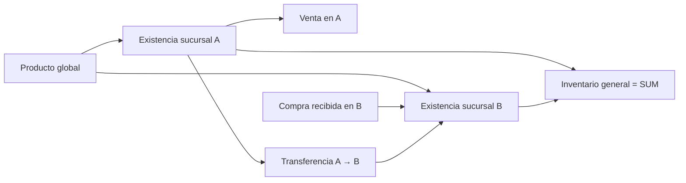
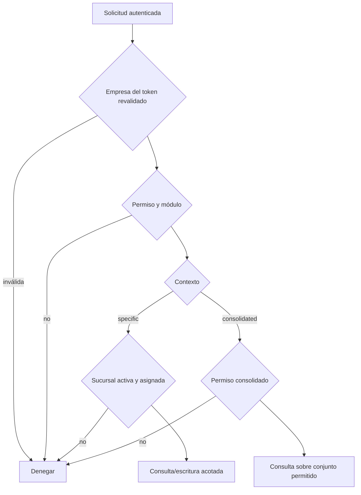

# TecnoOne SaaS Multisucursal V1

## Estado y alcance

Este documento define la arquitectura objetivo V1 del contexto multisucursal de TecnoOne. Consolida las decisiones necesarias antes de adaptar inventario, ventas, compras, reparaciones y demás módulos operativos. No describe una implementación terminada ni autoriza cambios funcionales fuera del roadmap.

## Principios

- La jerarquía de aislamiento es **plataforma > empresa > sucursal > usuarios**.
- La empresa autenticada se obtiene del usuario revalidado en backend; nunca del frontend.
- La sucursal operativa se obtiene de un contexto validado en backend; nunca se confía directamente en `sucursal_id` enviado por el frontend.
- No existe una sucursal ficticia llamada “Todas”. El consolidado es un modo de consulta.
- Toda escritura operativa requiere una sucursal específica.
- El modo consolidado es principalmente de lectura, agregación y análisis.
- Los catálogos empresariales se almacenan una sola vez por empresa; los saldos y operaciones se almacenan por sucursal.

## Jerarquía y responsabilidades



| Nivel | Responsabilidad | Regla de aislamiento |
|---|---|---|
| Plataforma | Empresas, planes, suscripciones y soporte global | Solo Super Admin de plataforma |
| Empresa | Configuración, roles y catálogos compartidos | `empresa_id` autoritativo del backend |
| Sucursal | Existencias, cajas y operaciones | Empresa + sucursal autorizada |
| Usuario | Roles, permisos y sucursales asignadas | Identidad revalidada contra base de datos |

## Roles

| Rol conceptual | Alcance | Capacidades esperadas |
|---|---|---|
| Super Admin | Plataforma | Administra empresas y suscripciones; no opera como usuario de sucursal |
| Admin empresa | Empresa | Administra configuración, usuarios, roles, sucursales y consultas consolidadas autorizadas |
| Admin sucursal | Sucursales asignadas | Administra operaciones de sus sucursales según permisos; no administra el tenant completo por defecto |
| Usuario operativo | Sucursales asignadas | Ejecuta operaciones específicas según permisos funcionales |

Los nombres de rol no sustituyen los permisos. La autorización efectiva combina identidad, empresa, permisos y alcance de sucursal. “Admin sucursal” es un rol objetivo; su capacidad debe materializarse mediante RBAC y asignaciones en `usuario_sucursales`.

## Contexto global

### Specific

Representa una sucursal activa concreta. El backend debe comprobar que la sucursal:

- pertenece a la empresa autenticada;
- está activa;
- está asignada al usuario;
- es válida para la operación solicitada.

Es el único contexto permitido para escrituras operativas.

### Consolidated

Representa una consulta agregada sobre el conjunto de sucursales que el usuario puede consultar. No es un ID de sucursal ni una fila en `sucursales`.

Requiere un permiso explícito, por ejemplo `sucursales.contexto_consolidado`. Por defecto debe limitarse a las sucursales activas asignadas al usuario. Una política más amplia para administradores de empresa debe declararse expresamente.



## Selector del topbar

El selector es la fuente visible del contexto global. Debe:

- listar solo sucursales activas y asignadas;
- seleccionar inicialmente la última sucursal válida, luego la predeterminada y finalmente la primera disponible;
- mostrar “Todas las sucursales” solo si el usuario tiene permiso consolidado;
- representar `specific` y `consolidated` como modos distintos;
- invalidar y recargar los datos dependientes al cambiar;
- impedir que respuestas del contexto anterior contaminen el nuevo;
- exigir una sucursal concreta antes de iniciar una escritura desde consolidado.

La preferencia local mejora la experiencia, pero no concede autorización. El backend valida cada solicitud.

## Usuarios y asignaciones

`usuario_sucursales` es la relación autorizativa entre usuario y sucursal. Debe mantener:

- una o más sucursales activas por usuario empresarial;
- una sola `es_predeterminada` incluida dentro de las asignadas;
- coincidencia de `empresa_id` entre usuario, relación y sucursal;
- actualización transaccional de la asignación completa.

`sucursales.es_principal` identifica la principal de la empresa. `usuario_sucursales.es_predeterminada` identifica la preferencia del usuario; son conceptos diferentes.

Usuarios es un módulo administrativo: puede mostrar todos los usuarios de la empresa y ofrecer filtros locales por sucursal asignada. No debe cambiar implícitamente su alcance por el selector operativo.

## Clasificación de datos

### Globales por empresa

- productos y sus atributos comerciales;
- clientes;
- proveedores;
- roles y permisos;
- configuración empresarial;
- catálogo de sucursales y asignaciones de usuarios.

### Por sucursal

- existencias y reservas de productos;
- cajas;
- ventas;
- compras y recepciones;
- reparaciones y su operación;
- movimientos de inventario;
- transferencias entre sucursales.

## Inventario

El producto es único por empresa. Las existencias se separan en una entidad por sucursal, conceptualmente:

```text
productos(empresa_id, ...datos globales...)
producto_existencias(empresa_id, sucursal_id, producto_id, existencia, reservado, ...)
```

El inventario general no duplica productos ni mantiene un saldo maestro independiente. Se calcula:

```sql
SUM(producto_existencias.existencia)
```

La unicidad de existencias debe ser `(empresa_id, sucursal_id, producto_id)`. Los movimientos son la trazabilidad; los saldos deben actualizarse transaccionalmente.

## Operaciones por sucursal

- **Cajas:** pertenecen a una sucursal; toda mutación se valida contra el contexto específico.
- **Ventas:** registran sucursal y caja de la misma sucursal; descuentan existencias locales.
- **Compras:** registran sucursal receptora; aumentan existencias locales al confirmar recepción.
- **Reparaciones:** pertenecen a una sucursal responsable; cambios de ubicación deben ser explícitos y auditables.
- **Transferencias:** tienen sucursal origen y destino distintas de la misma empresa; generan salida y entrada dentro de una transacción.



## Autorización

Una solicitud empresarial se autoriza únicamente si cumple, en orden:

1. token válido y usuario activo revalidado;
2. empresa activa y suscripción vigente;
3. módulo habilitado por plan;
4. permiso funcional requerido;
5. contexto de sucursal válido;
6. entidad consultada o modificada dentro de la empresa y alcance autorizado.



## Seguridad y riesgos

- Manipulación de `empresa_id` o `sucursal_id` por el cliente.
- Consultas por ID filtradas por empresa pero no por sucursal.
- Adaptación parcial de un módulo con lecturas o agregados sin filtro.
- Escrituras ejecutadas accidentalmente desde consolidado.
- Relaciones entre entidades de sucursales distintas.
- Cachés frontend y solicitudes en vuelo pertenecientes al contexto anterior.
- Backfills que asignen historia a la principal sin evidencia suficiente.
- Ramas heredadas de Super Admin dentro de controladores empresariales.

La mitigación principal es derivar el alcance exclusivamente del backend y aplicar empresa y sucursal en la misma consulta o transacción.

## Estrategia de migración

Cada módulo se migra de forma independiente:

1. clasificar entidades globales y operativas;
2. diagnosticar datos y relaciones existentes;
3. agregar columnas inicialmente anulables;
4. ejecutar backfill documentado y verificable;
5. adaptar backend y pruebas de aislamiento;
6. adaptar frontend e invalidación de contexto;
7. convertir columnas a `NOT NULL` cuando no existan pendientes;
8. agregar FKs compuestas, índices y unicidades;
9. activar funcionalidad y observar métricas;
10. retirar compatibilidad heredada.

No se debe ejecutar una migración masiva de todas las tablas ni asumir que todo registro histórico pertenece a la sucursal principal.

## Matriz de módulos V1

| Módulo | Clasificación | Specific | Consolidated | Escritura consolidada |
|---|---|---:|---:|---:|
| Empresas, planes y suscripciones | Plataforma | N/A | Plataforma | Sí, solo Super Admin |
| Sucursales | Administrativo empresa | Filtro opcional | Sí | Sí, con permiso administrativo |
| Usuarios, roles y permisos | Administrativo empresa | Filtro local | Sí | Sí, con permiso administrativo |
| Configuración empresarial | Administrativo empresa | No aplica | Sí | Sí, con permiso administrativo |
| Productos | Catálogo global empresa | Sí, con existencia local | Sí | Catálogo sí; existencia no |
| Existencias y kardex | Operativo sucursal | Sí | Sí, agregado | No |
| Cajas | Operativo sucursal | Sí | Sí, consulta | No |
| Ventas | Operativo sucursal | Sí | Sí, consulta | No |
| Compras | Operativo sucursal | Sí | Sí, consulta | No |
| Reparaciones | Operativo sucursal | Sí | Sí, consulta | No |
| Transferencias | Operativo entre sucursales | Origen/destino explícitos | Sí, consulta | Operación especial validada |
| Clientes | Catálogo global empresa | Sí | Sí | Sí, con permiso funcional |
| Proveedores | Catálogo global empresa | Sí | Sí | Sí, con permiso funcional |
| Dashboard y reportes | Consulta | Sí | Sí | No |
| Auditoría | Administrativo/consulta | Sí | Sí | No |

## Roadmap sugerido

| Sprint | Objetivo |
|---|---|
| 1.20 | Contrato de contexto, RBAC consolidado, selector y disciplina de autorización |
| 1.21 | Usuarios/Cajas alineados, invalidación global y plantilla de migración |
| 1.22 | Productos globales y existencias por sucursal |
| 1.23 | Kardex y transferencias entre sucursales |
| 1.24 | Compras y recepción por sucursal |
| 1.25 | Ventas, cajas operativas y pagos por sucursal |
| 1.26 | Reparaciones y flujos de taller por sucursal |
| 1.27 | Dashboard, reportes, auditoría y consolidación completa |
| 1.28 | Endurecimiento, migración histórica y retiro de compatibilidad |

Los números son una secuencia propuesta; cada sprint debe cerrar migración, autorización, frontend y pruebas del módulo antes de avanzar.
